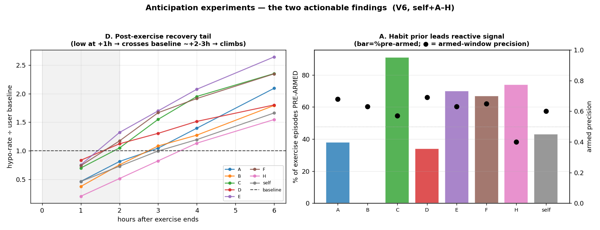

# Anticipation experiments — recurring structure for predictive dosing

_2026-07-09. Four Bayesian/pattern probes on `oref.boost_decisions` (V6, self+A–H). Question: is there recurring personal structure (exercise, sleep, dawn, recovery) regular enough to drive ANTICIPATORY dosing prep rather than reactive? Reproduce: `anticip_common.py` (cache) → `a_*/b_*/c_*/d_*.py`._

**The results inverted the a-priori ranking** — the target I recommended leading with (bedtime) is the weakest; the one I ranked last (post-exercise recovery) is the strongest. That is the value of running all four.

## Ranked findings

### D — Post-exercise recovery tail — STRONGEST, most actionable
After an exercise episode *ends*, hypo risk is **low at +1h (0.59× baseline), crosses baseline at ~+2–3h, and climbs** — a **delayed** recovery window, universal across all 8 users (see chart). The delayed *onset* (below baseline right after, elevated hours later) is the robust signal — it's the classic post-exercise glycogen-repletion sensitivity tail. **This is the cleanest anticipatory target:** the trigger (exercise end) is sharply detectable, and the hypo risk is *time-lagged* from it, so a scheduled post-exercise damper has hours of runway. Per-user severity scales with baseline hypo burden (D +3h 1.3×, self 1.0×→climbing).
- ⚠️ The +4h/+6h magnitudes (1.5×/1.9×) are partly a longer-window artifact (a 6 h window catches more lows than the 3 h baseline). The **crossover timing (~+2–3h)** is the artifact-free finding; don't quote the 1.9× as a clean effect size.

### A — Exercise anticipation leads the reactive signal — STRONG, viable
The habit prior `P(exercise | weekday, time-of-day)` predicts activity at **OOS AUC 0.85**, and — the gating question — it **pre-arms 55% of exercise episodes ~55 min BEFORE onset**, at **0.63 precision**. So a clock/weekday prior fires before the person moves, adding genuine lead over Boost's reactive steps signal, for the *majority* of episodes.
- Very habitual users (C 91% pre-armed, H/E/F 67–74%) vs irregular (B 0% — B exercises unpredictably). It's a per-user-strength lever.
- 0.63 precision = 37% false preps. For a *gentle* hypo-prep (ease insulin / small target raise) that's asymmetric-acceptable (false prep → mild high ≪ missed exercise → hypo), but the dosing-stage counterfactual caution still applies.

### C — Dawn phenomenon — FREQUENT but not timing-pre-emptable
A fasting dawn rise occurs on **82% of nights** (median **+55 mg/dL** — a big, near-nightly problem), but its **onset SD is 75 min** — too variable to pre-empt with a *timed* correction. Implication: the lever isn't "schedule a pre-dawn shot" (timing too loose) but a **standing overnight-into-dawn stance** (expect a rise most fasting nights). Ties to the morning-deficit finding. Frequent enough to matter, too irregular to schedule.

### B — Bedtime posterior — WEAKEST (bedtime too variable)
Per-user sleep-onset **SD ≈ 92 min** (median), weekday structure adds nothing (91 vs 92), and a learned prior does **not** beat a fixed clock (−2 min). So for most users the clock prior is **too loose to carry the SLEEPING transition when HR dies** — the upgrade I'd hoped would fix the degraded-HR sleep failures. **One exception:** user D is an extremely regular sleeper (SD 43 min, OOS MAE 14 min) — a bedtime prior would help *regular sleepers specifically*.
- ⚠️ Sleep-onset is *proxied* from activity-cessation (sleep-state isn't logged), which inflates SD. Real sleep-state logging would sharpen this — so "bedtime too variable" is a *provisional* NO, worth re-checking if/when `sleepState` is extracted. But the signal is that bedtime is genuinely less regular than exercise.

## What to do

1. **Build the post-exercise recovery damper (D).** Strongest, cleanest, universal, and the trigger→risk lag makes it a natural anticipatory action. Next step: characterise the tail shape per-user with a *matched-window* baseline (remove the window-length artifact), then spec a post-exercise-end sensitivity damper (V4 already has a recovery window — quantify whether its shape/duration matches this ~2–6h delayed tail).
2. **Exercise anticipation (A) as the second lever** — viable for habitual users; the honest gate (does it lead the reactive signal) PASSED at ~55 min. Spec a confidence-gated (Beta lower-bound) gentle hypo-prep, per-user-strength-aware (skip irregular exercisers like B).
3. **Dawn (C):** not a scheduled-shot target; fold into the overnight stance / night-mode work instead.
4. **Bedtime (B):** de-prioritised as a general lever; re-check only with real sleep-state logging, and only worthwhile for regular sleepers.

## Method notes / caveats

- All findings are **observational associations**; the *detection/prediction* stages (does structure exist, does it lead) are validated out-of-sample and clean, but any *dosing* action still hits the counterfactual-BG wall and needs the usual pricing + safety gating.
- Bayesian value here is the **decision layer** (Beta posteriors for sparse cells + lower-bound gating under asymmetric loss), not raw prediction (LightGBM/empirical rates already predict well).
- Meal-time anticipation is NOT here — already tested ≈chance (early-dosing audit); meals are the *irregular* habit, exercise/recovery the regular ones.
