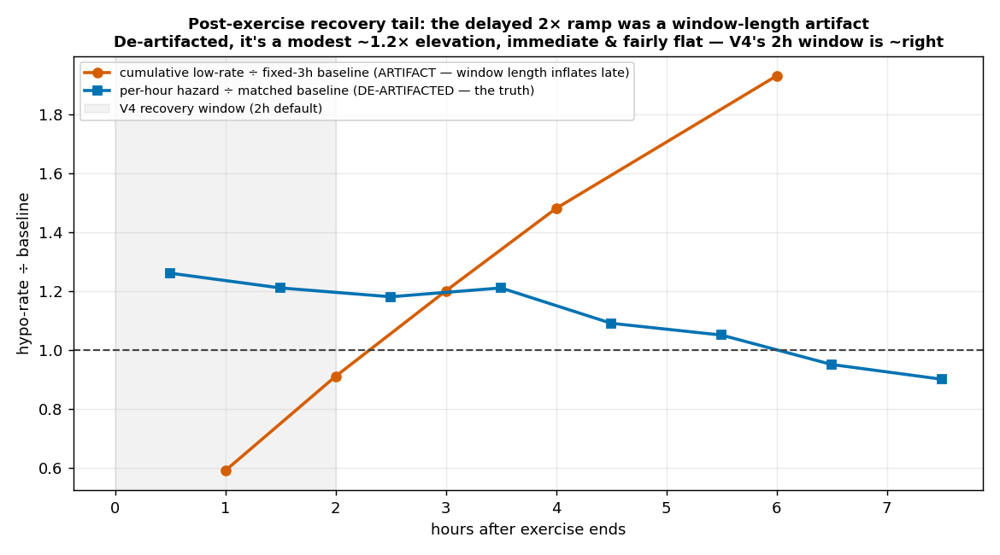

# Post-exercise recovery tail (de-artifacted) + rolling-24h load → sensitivity

_2026-07-09. Follow-up to `ANTICIPATION_REPORT.md`. Two threads, both DEFLATE the first-pass expectation — the disciplined outcome of de-artifacting. Reproduce: `recovery_tail_matched.py`, `steps24h_sensitivity.py`._

## Thread 1a — recovery tail: the delayed 2× ramp was an artifact

The original D finding (`ANTICIPATION_REPORT.md`) showed post-exercise hypo-rate "crossing baseline at +2–3h and climbing to ~2× by +6h." That compared a **+Nh cumulative** low-rate to a **fixed 3h baseline** — so the late horizons were inflated purely by window length.

**De-artifacted (per-hour hazard, matched baseline), the truth is modest and immediate:**

| hours after exercise end | 0–1 | 1–2 | 2–3 | 3–4 | 4–5 | 5–6 | 6–7 | 7–8 |
|---|---|---|---|---|---|---|---|---|
| cohort hypo-hazard ÷ baseline | 1.26× | 1.21× | 1.18× | 1.21× | 1.09× | 1.05× | 0.95× | 0.90× |

Post-exercise hypo hazard is **~1.2× baseline, elevated immediately, fairly flat across 0–5h, gone by +6h** — *not* a delayed 2× hump. Per-user it's noisy (E/F/C/D show it; self ~flat; H protective early).

**Corrected V4 verdict — my "inverted window" hypothesis was WRONG.** I predicted V4's 2h window protected the wrong period. De-artifacted: hazard is 1.25× in 0–2h (what V4 protects) and 1.15× in 2–6h — so **V4's 2h window is roughly right**, not inverted. The only defensible tweak is a *minor* one: extend the window to ~4–5h to catch the mild 1.1× tail, and/or a gentle taper rather than a hard 2h cutoff. This is a small refinement, **not** the big lever the first pass implied.

## Thread 2 — rolling-24h step load → subsequent sensitivity: NULL

Physiology predicts exercise raises insulin sensitivity for 24–48h. Three views, fasting cycles:

| view | result | reading |
|---|---|---|
| A. forward-low at matched IOB (3–8%), by within-user load tertile | cohort hi/lo ratio **1.06** | ~null; high load ≠ more lows at same IOB |
| B. BGI residual (actual−expected ΔBG) vs load | median slope **+1.03** (wrong sign) | no evidence load makes insulin land harder |
| C. autosens (`tdd_adj_factor`) vs load | corr **−0.06** | autosens ignores load — but there's nothing to capture |

**No consistent rolling-24h-load → sensitivity signal in this cohort.** A couple of users hint at it in view A (C 1.28, E 1.38, H 1.34) but it reverses in others (D 0.78, self 0.82) and doesn't survive view B. The 24–48h sensitivity effect is either masked by the algorithm's IOB model / day-to-day noise, or too small/inconsistent here to drive a lever. **NO-GO as a sensitivity adjustment** — and since the signal is absent, the fact that autosens doesn't track load (C) is moot, not a gap.

## Net

Both threads are honest deflations:
- **Recovery tail:** real but modest (~1.2×, immediate), and V4 already handles it about right — at most a minor window-extension/taper, not a headline lever. The exciting first-pass shape was a measurement artifact.
- **Load→sensitivity:** no reliable signal; don't build it.

The one thing that *survives* from the anticipation thread is **exercise anticipation itself** (the habit prior leads the reactive signal by ~55 min, AUC 0.85) — that wasn't artifact-driven. But with the post-exercise hypo now sized at ~1.2× (not 2×), the *value* of anticipatory prep is real-but-modest — spec calibrated accordingly in `EXERCISE_PREP_SPEC.md`.

## Method note

This is the second time in two days that a striking surface finding dissolved under a proper baseline (cf. the brake "34%" → 90%-right, and the cohort "+13pp" → overnight-only/confounded). The pattern is consistent: **always price against a matched baseline before believing an effect size.**
