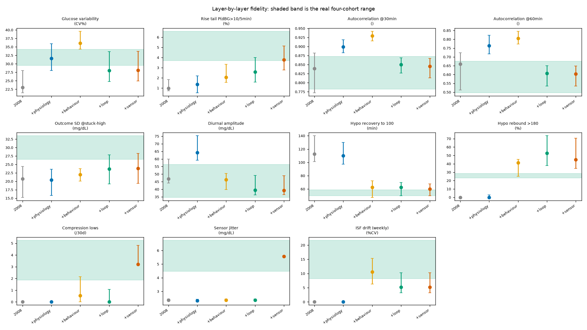

# Does the behaviour layer close the remaining fidelity gaps? Measured

The physiology refinement closed one signature of eleven and the sensor layer closed two more, which left four that `REPORT_POC.md` attributed not to the model but to the person: unannounced meals, rescue carbohydrate and its over-treatment, and an insulin-sensitivity setting that adapts. This table adds that layer, and a fifth for the fact that every real cohort in the comparison is running a closed loop while the simulated person was on open-loop basal-bolus. Each column adds one mechanism to the column before it, so movement is attributable. Adult personae, 10 x 28 days, per-persona median [bootstrap 95% CI]. The real range is the envelope across four cohorts and 192 users.

No parameter in the behaviour layer was fitted to a signature in this table. Carbohydrate-counting error, announcement rate and rescue-treatment size come from the clinical literature (see `behaviour.py`), so these columns are a test rather than a restatement of the inputs.

| Signature | Real range | 2008 | +physiology | +behaviour | +loop | +sensor | In range |
|---|---|---|---|---|---|---|---|
| Glucose variability (CV%) | 29.5-34.3 | 23.1 [21.5-28.0] | 31.6 [28.0-35.9] | 36.1 [34.3-39.6] | 28.0 [24.8-33.6] | 28.2 [24.9-33.7] | no |
| Rise tail P(dBG>10/5min) (%) | 3.7-6.6 | 1.0 [0.7-1.8] | 1.4 [0.5-2.2] | 2.1 [1.6-3.3] | 2.6 [1.6-4.0] | 3.8 [2.8-5.1] | YES |
| Autocorrelation @30min () | 0.8-0.9 | 0.8 [0.8-0.9] | 0.9 [0.9-0.9] | 0.9 [0.9-0.9] | 0.8 [0.8-0.9] | 0.8 [0.8-0.9] | YES |
| Autocorrelation @60min () | 0.5-0.7 | 0.7 [0.5-0.7] | 0.8 [0.7-0.8] | 0.8 [0.8-0.8] | 0.6 [0.5-0.6] | 0.6 [0.5-0.6] | YES |
| Outcome SD @stuck-high (mg/dL) | 26.5-33.5 | 20.8 [15.2-24.4] | 20.4 [15.8-23.6] | 22.0 [20.0-23.8] | 23.7 [19.3-27.9] | 23.9 [19.4-28.2] | no |
| Diurnal amplitude (mg/dL) | 34.7-56.3 | 46.9 [44.1-59.9] | 64.2 [59.1-75.3] | 46.3 [39.9-50.4] | 39.4 [36.3-49.0] | 39.2 [36.4-48.9] | YES |
| Hypo recovery to 100 (min) | 50.0-59.0 | 112.5 [101.2-140.0] | 110.0 [97.5-130.0] | 62.5 [47.5-72.5] | 62.5 [50.0-70.0] | 60.0 [50.0-67.5] | no |
| Hypo rebound >180 (%) | 23.2-28.4 | 0.0 [0.0-0.0] | 0.0 [0.0-2.9] | 41.3 [25.0-45.5] | 52.8 [37.8-73.5] | 44.9 [34.6-70.7] | no |
| Compression lows (/30d) | 1.9-5.3 | 0.0 [0.0-0.0] | 0.0 [0.0-0.0] | 0.5 [0.0-2.1] | 0.0 [0.0-1.1] | 3.2 [3.2-4.8] | YES |
| Sensor jitter (mg/dL) | 4.5-6.7 | 2.4 [2.3-2.4] | 2.3 [2.2-2.4] | 2.4 [2.3-2.4] | 2.4 [2.3-2.4] | 5.6 [5.5-5.6] | YES |
| ISF drift (weekly) (%CV) | 8.2-21.7 | 0.0 [0.0-0.0] | 0.0 [0.0-0.0] | 10.6 [6.3-15.3] | 5.2 [3.2-10.2] | 5.2 [3.2-10.2] | no |

## What moved

Signatures inside the real range: 3 of 11 for the 2008 baseline, 6 of 11 with all four layers.

- Brought into range: Rise tail P(dBG>10/5min), Compression lows, Sensor jitter.
- Still outside: Glucose variability, Outcome SD @stuck-high, Hypo recovery to 100, Hypo rebound >180, ISF drift (weekly).
- Moved out of range that the 2008 model had matched: none.

## Reading it

The two layers do different work and the split is clean. The behaviour layer supplies the disturbances: unannounced meals lift the rise tail, rescue carbohydrate takes hypoglycaemia recovery from 110 minutes to 62 against a real 50 to 59, and an adapting setting gives the drift signature something to read at 10.6% where it had been a structural zero. It also pulls the diurnal amplitude back from 64 to 46 mg/dL, undoing the overshoot the physiology refinement had introduced.

The loop layer supplies the damping. Both autocorrelations had risen out of range as each layer added variance, and continuous correction brings them back: 0.93 to 0.85 at 30 minutes and 0.81 to 0.61 at 60, both inside the real range. Glucose variability follows the same path, overshooting to 36.1% without a loop and settling at 28.2% with one, just under the real 29.5 to 34.3. This is the part that had been missing from the comparison rather than from the model: every real cohort here is running an automated loop, and the simulated person was not.

Three things did not come right, and they are worth separating.

Hypoglycaemia rebound overshoots badly, 45% against a real 23 to 28. The over-treatment assumption, a second helping on 35% of rescues, is too aggressive for what these cohorts actually do. It could be fitted, and deliberately has not been, because fitting it would turn this row from a test into a restatement. Read as a measurement, it says real closed-loop users over-treat less than the standard clinical account of over-treatment implies.

Insulin-sensitivity drift falls from 10.6% to 5.2% when the loop is added, below the real 8.2 to 21.7. The loop holds glucose closer to target, so the weekly adaptation has less error to chase. Real drift is partly physiological rather than purely a response to outcomes, which this adapter does not represent.

Outcome spread at stuck-high moves from 20.8 to 23.9 mg/dL against a real 26.5 to 33.5, and is the one signature no layer has closed across the whole programme. The fast stochastic efficacy process aimed straight at it did not close it either. Whatever makes real insulin action unpredictable at the half-hour horizon is still not in the model, and this remains the honest limit on using the simulator to price a dosing change.

## Survival

simglucose ends an episode when blood glucose falls below 10 mg/dL, so a truncated series means the virtual patient did not survive the run. Every earlier comparison in this suite silently conditioned on survival by taking whatever series it was given.

| Column | Personae completing the run | Median fraction of the run completed |
|---|---|---|
| 2008 | 9 of 10 | 1.00 |
| +physiology | 8 of 10 | 1.00 |
| +behaviour | 9 of 10 | 1.00 |
| +loop | 10 of 10 | 1.00 |

