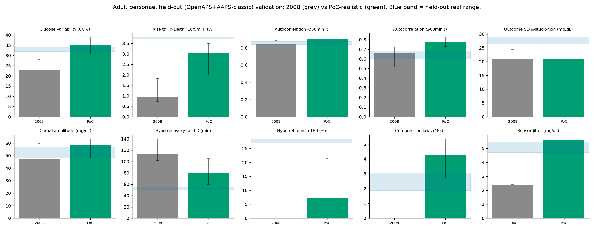

# PoC-realistic simulator: held-out fidelity validation

**Scope: this is a stress-test simulator proof-of-concept, not a certified counterfactual or dosing-A/B engine.** It exists to widen the 2008 personae's statistical envelope towards real CGM data for stress-testing purposes; it is not validated for, and should not be used for, simulating a specific dosing policy change.

Free parameters (fast insulin-efficacy sigma in `gen_sim_realistic.py`; sensor noise sigma and compression rate in `sensor_layer.py`) were fit against the **Boost + Trio** cohorts only (fit targets shown for reference). This table evaluates the fitted simulator against the **held-out OpenAPS + AAPS-classic** envelope, cohorts that played no part in fitting, so this is an honest cross-cohort check rather than a fit-and-report-on-the-same-data exercise. All figures are adult personae, 10 x 14 days; 'PoC-realistic' = efficacy layer (in-ODE) + sensor layer (post-hoc). Each cell is the per-persona median [bootstrap 95% CI].

| Signature | Held-out real range | Fit target (Boost+Trio) | 2008 baseline | PoC-realistic | In held-out range? |
|---|---|---|---|---|---|
| Glucose variability (CV%) | 31.9-34.3 | 29.5-33.4 | 23.1 | 35.1 [30.7-38.9] | no |
| Rise tail P(Delta>10/5min) (%) | 3.7-3.8 | 4.3-6.6 | 1.0 | 3.0 [2.0-3.5] | no |
| Autocorrelation @30min () | 0.8-0.9 | 0.8-0.8 | 0.8 | 0.9 [0.9-0.9] | no |
| Autocorrelation @60min () | 0.6-0.7 | 0.5-0.6 | 0.7 | 0.8 [0.7-0.8] | no |
| Outcome SD @stuck-high (mg/dL) | 26.5-28.8 | 29.8-33.5 | 20.8 | 21.1 [17.6-22.4] | no |
| Diurnal amplitude (mg/dL) | 48.4-56.3 | 34.7-41.3 | 46.9 | 58.8 [47.8-63.4] | no |
| Hypo recovery to 100 (min) | 50.0-55.0 | 50.0-59.0 | 112.5 | 80.0 [60.0-105.0] | no |
| Hypo rebound >180 (%) | 27.2-28.4 | 23.2-25.8 | 0.0 | 7.3 [1.9-21.4] | no |
| Compression lows (/30d) | 1.9-3.0 | 4.6-5.3 | 0.0 | 4.3 [2.7-5.4] | no |
| Sensor jitter (mg/dL) | 4.7-5.5 | 4.5-6.7 | 2.4 | 5.6 [5.5-5.7] | no |
| ISF drift (weekly %CV) | n/a | n/a | 0 | 0 | no (structural) |

## Verdict

The two-cohort held-out envelope is narrow, so the strict in-range binary above is harsh; the movement from the 2008 baseline and membership of the full four-cohort real range tell the clearer story.

The sensor layer does its job. Sensor jitter moves from 2.4 to 5.6 mg/dL and compression lows from 0 to 4.3 per 30 days, and both land inside the full four-cohort real range (4.5 to 6.7 and 1.9 to 5.3). These are the two gaps a post-hoc sensor model can close directly, and it closes them on cohorts the fit never saw.

The efficacy layer does not. The stuck-high outcome spread barely moves, from 20.8 to 21.1 mg/dL against a real 27 to 34, and that small change is accounted for by the added sensor noise alone; the fast mean-reverting efficacy process averages out over the thirty-minute horizon the signature looks across, so it adds almost no stuck-high unpredictability. This is the same wall seen elsewhere in the programme: the efficacy blind spot resists even a stochastic layer aimed straight at it, because reproducing the marginal spread is not the same as reproducing the state-dependent way real insulin action varies.

The added noise also overshoots. Variability, the diurnal amplitude and the 30- and 60-minute autocorrelations all move above the real range, the same over-smooth and over-regular tendency the reconstructed S2013 showed, because injecting variance is not the same as injecting the right variance with the right structure. And the behavioural gaps remain: the unannounced-meal rise tail and the hypoglycaemia recovery and rebound need unannounced meals, a reactive controller and a carbohydrate-treatment model, a person in the loop, which no physiology or sensor layer can supply. ISF drift stays a structural zero because the basal-bolus controller uses a fixed insulin-to-carbohydrate ratio.

Signatures the PoC brings into the full four-cohort real range that the 2008 model missed: Compression lows, Sensor jitter. The PoC does not change the identification constraint; there is still no glucodynamic simulator that reproduces a specific person's counterfactual trajectory under a dosing change. What it demonstrates is narrower and real: a post-hoc sensor model closes the sensor-fidelity gaps cleanly, while the efficacy gap and the behavioural gaps do not yield to the layers a stress-test simulator can add, which is exactly where the harder work lies.

