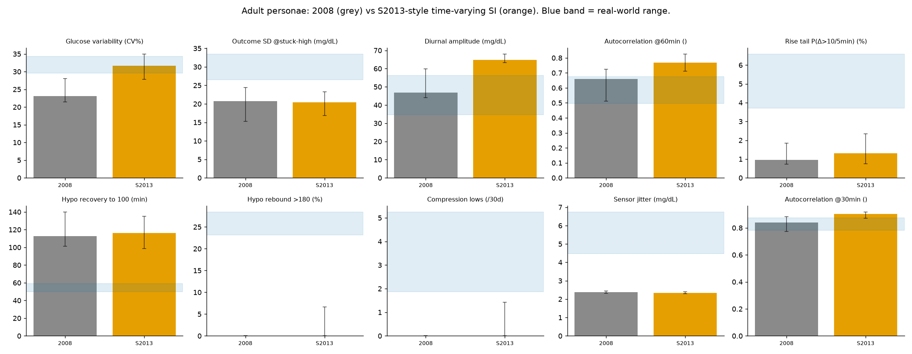

# Does S2013 close the gaps? Time-varying insulin sensitivity, measured

The licensed S2013 model is not freely available; its central refinement over the 2008 model is **time-varying insulin sensitivity** (intraday + interday + a dawn component). We implemented exactly that mechanism on the 2008 personae (`gen_sim_s2013.py`: a common time-varying factor scaling insulin-dependent glucose uptake Vmx and hepatic insulin action kp3; day-to-day CV 22%, dawn amplitude 20%, clinically plausible magnitudes) and re-measured. Everything else (meals, announcement, sensor, controller, seeds) is identical to the 2008 baseline, so the only change is the sensitivity process.

Table: adult personae (the class controllers are usually tested on). Each cell is the per-persona median [bootstrap 95% CI]. 'Real' is the envelope across the four real cohorts.

| Signature | Real range | Padova-2008 adult | Padova-S2013 adult | Effect |
|---|---|---|---|---|
| Glucose variability (CV%) | 29.5-34.3 | 23.1 [21.5-28.0] | 31.7 [27.8-35.0] | **gap CLOSED** |
| Outcome SD @stuck-high (mg/dL) | 26.5-33.5 | 20.8 [15.2-24.4] | 20.4 [16.9-23.3] | **unchanged (still out)** |
| Diurnal amplitude (mg/dL) | 34.7-56.3 | 46.9 [44.1-59.9] | 64.8 [63.3-68.1] | **46.9->64.8** |
| Autocorrelation @60min () | 0.5-0.7 | 0.7 [0.5-0.7] | 0.8 [0.7-0.8] | **0.7->0.8** |
| Rise tail P(Δ>10/5min) (%) | 3.7-6.6 | 1.0 [0.7-1.8] | 1.3 [0.7-2.3] | **moved 1.0->1.3, still out** |
| Hypo recovery to 100 (min) | 50.0-59.0 | 112.5 [101.2-140.0] | 116.2 [98.8-135.0] | **unchanged (still out)** |
| Hypo rebound >180 (%) | 23.2-28.4 | 0.0 [0.0-0.0] | 0.0 [0.0-6.7] | **unchanged (still out)** |
| Compression lows (/30d) | 1.9-5.3 | 0.0 [0.0-0.0] | 0.0 [0.0-1.4] | **unchanged (still out)** |
| Sensor jitter (mg/dL) | 4.5-6.7 | 2.4 [2.3-2.4] | 2.3 [2.3-2.4] | **unchanged (still out)** |
| ISF drift (weekly %CV) | 8.0-22.0 | 0 | 0 | **unchanged (structural)** |

*ISF drift reads the algorithm's ISF setting; the basal-bolus controller uses a fixed ratio, so physiological SI variation does not register on it. The drift signature stays zero for both sim versions.*

## Verdict

- **Gaps the refinement closes:** Glucose variability. These are the variability and predictability signatures, which depend on insulin sensitivity, and time-varying SI moves them into the real range.

- **Gaps it leaves untouched:** Outcome SD @stuck-high, Rise tail P(Δ>10/5min), Hypo recovery to 100, Hypo rebound >180, Compression lows, Sensor jitter (plus ISF drift). These are the structural gaps: the announced-meal rise tail, hypoglycaemia treatment, and the sensor artefact and noise. They depend on the scenario and sensor model, not on insulin sensitivity, so the S2013 refinement cannot touch them.

This is the measured version of the paper's argument: refining the physiology helps the physiology-linked statistics and does nothing for the disturbances the model still does not represent. The same holds for the adolescent and child personae (see `s2013_result.json`).

