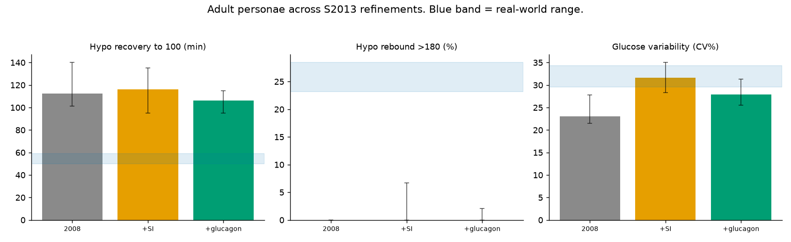

# Does S2013's glucagon counter-regulation close the hypo gap? Measured

Adds the glucagon counter-regulation model (endogenous glucose release when glucose is low and falling) on top of the S2013-style insulin-sensitivity variability, and re-measures. The functional mechanism is implemented (`gen_sim_s2013_full.py`: basal EGP boosted by depth below 80 mg/dL and rate of fall); the licensed multi-state glucagon ODE and per-subject parameters are not public. Adult personae; each cell is the per-persona median [95% CI].

| Signature | Real range | 2008 | +SI | +SI+glucagon | Effect of glucagon |
|---|---|---|---|---|---|
| Hypo recovery to 100 (min) | 50.0-59.0 | 112.5 [101.2-140.0] | 116.2 [95.0-135.0] | 106.2 [95.0-115.0] | **116.2->106.2 (closer to real)** |
| Hypo rebound >180 (%) | 23.2-28.4 | 0.0 [0.0-0.0] | 0.0 [0.0-6.7] | 0.0 [0.0-2.1] | **0.0->0.0 (no closer)** |
| Glucose variability (CV%) | 29.5-34.3 | 23.1 [21.5-27.8] | 31.7 [28.3-35.0] | 27.9 [25.5-31.3] | **unchanged** |
| Rise tail P(Δ>10/5min) (%) | 3.7-6.6 | 1.0 [0.7-1.8] | 1.3 [0.7-2.3] | 1.2 [0.7-1.9] | **unchanged** |
| Compression lows (/30d) | 1.9-5.3 | 0.0 [0.0-0.0] | 0.0 [0.0-1.4] | 1.4 [0.0-1.4] | **0.0->1.4** |
| Sensor jitter (mg/dL) | 4.5-6.7 | 2.4 [2.3-2.4] | 2.3 [2.3-2.4] | 2.3 [2.3-2.4] | **unchanged** |

## Verdict

- **Hypo recovery**: real 50-59 min; sim 112 (2008) -> 116 (+SI) -> 106 (+glucagon) min. Counter-regulation moves it toward but not into the real range: endogenous glucose release speeds recovery, but it is not the carbohydrate people actually eat, which is faster and larger.

- **Hypo rebound**: real 23-28%; sim 0 -> 0 -> 0%. Counter-regulation is self-limiting and does not overshoot the way a treated low does.

- **Rise tail and sensor jitter** are unmoved, as expected: they depend on the scenario and sensor, not on counter-regulation.

- **Compression lows** read as a small non-zero rate with glucagon, but this is a detector artefact rather than a new sensor mechanism: counter-regulation produces sharp, fast-reversing physiological lows, and our compression signature keys on that reversing shape, which it cannot distinguish from a true sensor compression artefact. The model still has no sensor compression; it now has hypos that happen to look like it.

So the one S2013 refinement that could touch the hypo gap does move it in the right direction, but does not close it, because the real recovery is driven by carbohydrate treatment the simulator still does not model. The same holds for the adolescent and child personae (`s2013_glucagon_result.json`).

