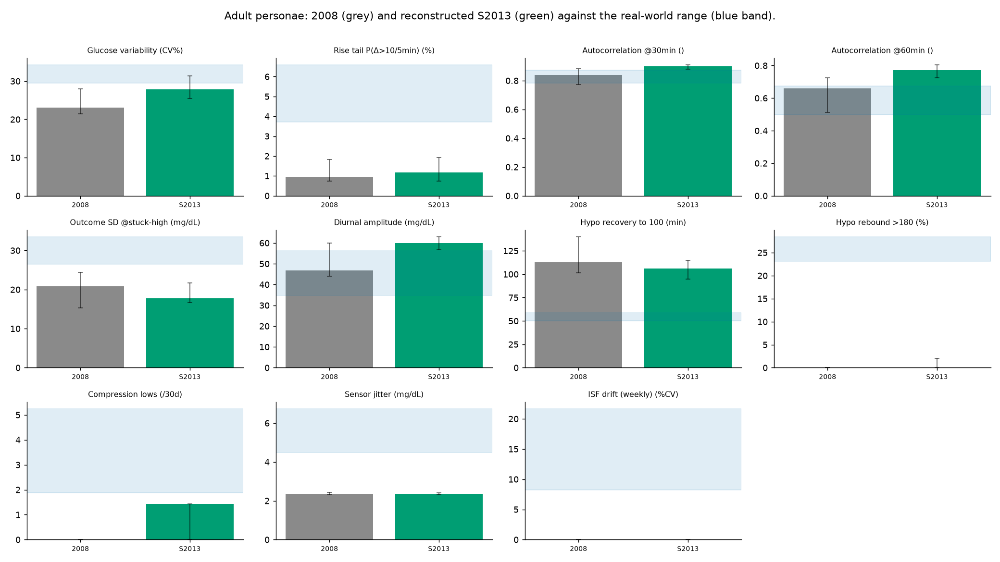

# Reconstructed S2013 versus 2008 and real data, all metrics together

We reconstruct S2013 by adding both of its headline changes to the 2008 personae at once, the time-varying insulin sensitivity and the glucagon counter-regulation (`gen_sim_s2013_full.py`), and report every signature for the reconstruction alongside the 2008 baseline and the real-world envelope. The improved hypoglycaemia glucose kinetics of S2013 is not included, which we note as a caveat. Adult personae; per-persona median [95% CI].

| Signature | Real range | 2008 | Reconstructed S2013 | In real range |
|---|---|---|---|---|
| Glucose variability (CV%) | 29.5-34.3 | 23.1 | 27.9 [25.5-31.3] | no |
| Rise tail P(Δ>10/5min) (%) | 3.7-6.6 | 1.0 | 1.2 [0.7-1.9] | no |
| Autocorrelation @30min () | 0.78-0.87 | 0.84 | 0.90 [0.88-0.91] | no |
| Autocorrelation @60min () | 0.50-0.68 | 0.66 | 0.77 [0.73-0.80] | no |
| Outcome SD @stuck-high (mg/dL) | 26.5-33.5 | 20.8 | 17.8 [16.6-21.7] | no |
| Diurnal amplitude (mg/dL) | 34.7-56.3 | 46.9 | 59.9 [56.6-63.0] | no |
| Hypo recovery to 100 (min) | 50.0-59.0 | 112.5 | 106.2 [95.0-115.0] | no |
| Hypo rebound >180 (%) | 23.2-28.4 | 0.0 | 0.0 [0.0-2.1] | no |
| Compression lows (/30d) | 1.9-5.3 | 0.0 | 1.4 [0.0-1.4] | no |
| Sensor jitter (mg/dL) | 4.5-6.7 | 2.4 | 2.3 [2.3-2.4] | no |
| ISF drift (weekly) (%CV) | 8-22 | 0 | 0 | no |

Signatures the reconstruction reaches the real range on: none.

## Reading it

The reconstruction matches none of the eleven signatures for the adult personae, and it moves three that the 2008 model had matched out of range. The two additions partly work against each other: the time-varying sensitivity widens the glucose distribution while the counter-regulation damps the very lows that widen it, so overall variability rises only from about 23 to 28% and stays below the real band, and the stuck-high outcome spread does not improve but slightly narrows. What the additions mostly do is make the glucose curve smoother and more regular, so the 30- and 60-minute autocorrelations rise above the real range and the diurnal amplitude overshoots, three quantities the 2008 model had reproduced. The hypoglycaemia-recovery gap narrows but stays about twice too slow with no rebound, and the unannounced-meal rise tail, the sensor jitter and the sensitivity drift do not move at all, because none of them depends on insulin sensitivity or on counter-regulation. The exact size of the overshoots depends on the magnitudes we chose, which are plausible rather than fitted, but the direction (smoother and more regular, not more realistic on the disturbances) is intrinsic to what the refinements change. The small non-zero compression reading is a detector artefact: counter-regulation makes sharp reversing lows that share the shape of a sensor compression low, so the model has gained lows that resemble the artefact rather than the artefact itself.

