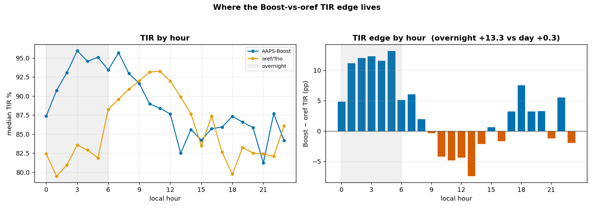

# Where the Boost-vs-oref edge lives — regime decomposition

_Follow-up to `COHORT_BGLEVEL_REPORT.md`, 2026-07-08. Boost-dosing cohort (AAPS, V1+ gen) vs oref/Trio reference. Reproduce: `cohort_regime.py`._

## Headline: the edge is overnight, and the daytime "wash" hides a post-breakfast deficit

| regime | Boost TIR | oref TIR | TIR gap | TBR<70 gap | TAR>180 gap |
|---|---|---|---|---|---|
| **Overnight** (00:00–05:59 local) | 93.6 | 80.3 | **+13.3** | **−4.4** | **−9.1** |
| **Daytime** (06:00–23:59) | 86.9 | 86.6 | +0.3 | +0.2 | −0.8 |
| All | 88.1 | 85.2 | +2.9 | −0.3 | −2.3 |

The aggregate +2.9 pp is **entirely an overnight phenomenon**: overnight, Boost is +13.3 pp TIR with **both far fewer lows (−4.4) and far fewer highs (−9.1)** than oref/Trio. Daytime is a dead heat in aggregate — but the hourly curve shows the two cohorts run almost **anti-phase**:

- **Overnight (00–06):** Boost dominant (+5 to +13 pp) — Boost peaks at 94–96% TIR while oref sits at 79–83% (dawn highs + basal lows, a bimodal overnight failure).
- **Mid-morning / post-breakfast (~09–13):** **oref is BETTER** (Boost −4 to −7 pp) — Boost's relative weakness is the post-breakfast window.
- **Evening (17–22):** Boost regains a slight edge, cancelling the morning deficit → the +0.3 daytime net.

## Broad-based, not an outlier or artifact

Per-user (night vs mid-morning 09–12 TIR):
- **Boost: 7 of 9 users are best (or equal) overnight** — F +36.5, C +9.0, G +5.1, H +3.3, A +3.0, tim +2.1, E +0.9 (only B −19 and D −0.5 buck it).
- **oref/Trio: 13 of 21 are worst overnight** — U009 −35, U004 −28, U018 −21, U020 −20, U016 −15, U001 −15, U012 −13… (median clearly negative).

A split this consistent across ~30 users is a **physiological/mechanism signature**, not a tz mislabel (which would smear the diurnal shape) and not selection (which would be flat across the day, not overnight-specific).

## Interpretation

1. **Overnight is Boost's real differentiator (+13 pp).** Boost's overnight machinery — night mode / sleep-gated dosing — delivers both fewer lows and fewer highs while the oref/Trio cohort suffers the classic unhandled overnight (dawn phenomenon up, basal-drift down). This is the clean, mechanism-coherent part of the cohort edge, and it substantially **strengthens the causal reading** the flat aggregate obscured.
2. **Post-breakfast is Boost's deficit vs oref (−4 to −7 pp).** Boost is relatively *worse* than oref in the mid-morning meal window — squarely consistent with the residency lever map (highs are **sizing + timing**: late-confirm and undersized meal responses). oref's UAM/SMB handles the post-breakfast rise better than Boost's confirm machinery currently does.
3. **The aggregate massively undersold both.** +2.9 pp (NS) is a large overnight win partly offset by a morning deficit — averaging them hides the two mechanisms that actually matter.

## Actionable

- **Overnight machinery is validated as Boost's strength** — protect it; it's the win.
- **Post-breakfast meal handling is the priority daytime lever** — the confirm age-gate / sizing work (residency: LATE_CONFIRM + UNDERSIZED) targets exactly the window where Boost trails oref. Closing the mid-morning gap is where daytime TIR is recoverable.

## Caveats

- Population comparison (9 Boost vs 21 oref/Trio); selection uncontrolled — but the *time-specific* structure (overnight-only advantage + a compensating morning deficit) is far harder to explain by selection than a flat offset would be.
- Local hour: AAPS uses per-user tz from the registry; oref/Trio uses its stored `hour`. A modest tz error cannot manufacture a +13/−0.3 split that reverses within the day and holds across ~30 users.
- B (Boost) and a handful of oref users buck the cohort pattern — real individual variation, not fatal to the median result.
